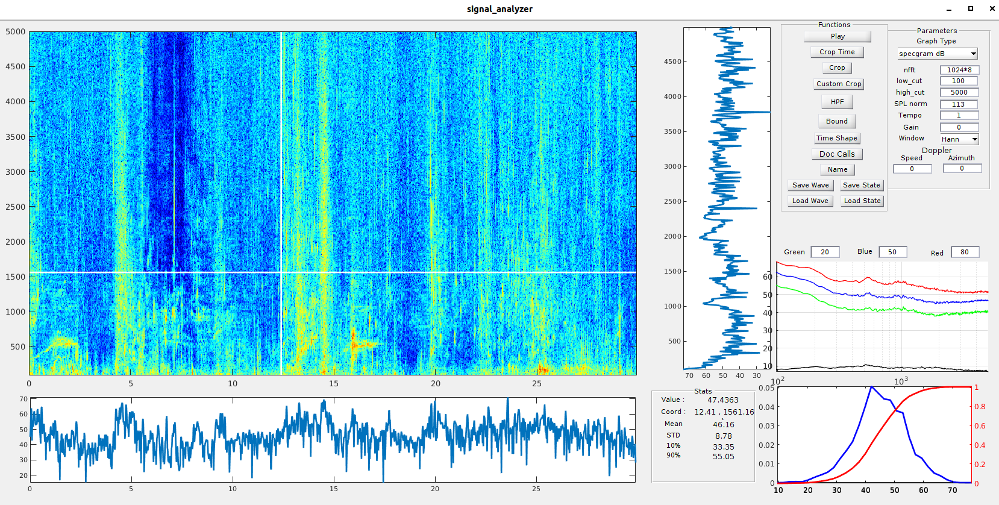

# Deep Voice
Audio analysis toolbox made for bio-acoustics using Matlab.

## Main Features
The core of the program is a signal analyzer GUI which containts different axes and buttons

A demo of usage is found [here](https://drive.google.com/open?id=14VlU-bIzcIabtnQ_MAPfv4K1Qsu-mv6K).

### 1. Functions

* Play - play the audio file. Using red line tracking the spectrogram for visualization.
* Crop time - Crop the audio clip to desired time using two clicks on the main screen.
* Crop - Crop/Block part of the signal by assigning a rectangular using 4 clicks on the desired area.
* Custom Crop - Crop/Block part of the signal by custom shape.
* HPF - Apply High Pass Filter to remove low frequencies from recording (usually waves/wind noise).
* Bound - Bound areas of interest guessed by enrergy and entropy dedectors.
* Time Shape - Plot the wave time function on a specific ares, click before with mouse on desired area.
* Doc Calls - Used for annotating data on the spectrogram. 
* Name - change the name of the figure
* Save/Load State - Save the current session/Load a previous session
* Save/Load Wave - Save the current audio/Load a different audio 

### 2. Parameters

* Graph Type - choose the desired graph to show on main axes 
* nfft - number of fft bins used for spectrogram. Increasing would add details to the frequency and reduce from the time axis, and vice versa. Use powers of 2 for efficiency. 
* low_cut - lowest frequency to present
* low_cut - highest frequency to present
* SPL norm - The initial gain of the original recording
* Tempo - Rate of sound playing
* Gain - add/reduce gain to the recording
* Window - Change window type of the STFT. Default is Hanning
* Doppler - Add speed and azimuth data to take into account doppler effect and change the signal accordinly. 

### 3. GUI Axes
* Main - Contains the spectrogram of the audio signal
* Frequencies graph - right to the main axes, shows the frequency projection on selected line
* Frequency-time graph - below to the main axes, shows the a specific frequency power change in time
* specgram graph - right to the frequency graph, show different percentiles of SPL for all the frequencies.
* Statistics graph - Show the statistics of seltected frequency

## Usage

run demo:
```
disp_file('./14.9.18/recordings/180914_150127_context.wav',1,0,30)
```
The first argument is the path to the .wav file. You may change it to any other .wav file and run the program.

## Official Site
Visit our site to hear more about us and get updated with our activities:
[http://www.deepvoicefoundation.com](http://www.deepvoicefoundation.com)
